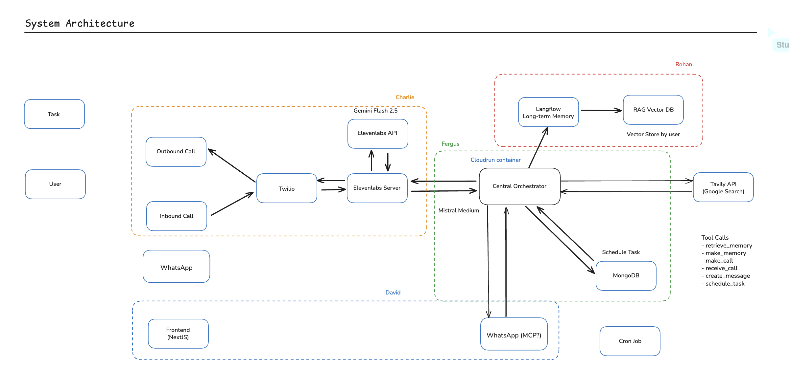

# Langflow Voice Agent Platform
**Langflow Hacking Agents Hackathon Project**

An intelligent voice agent platform that integrates ElevenLabs Conversational AI with Twilio for seamless inbound and outbound phone calls, enhanced with Langflow's orchestration capabilities and multi-modal communication channels.

## System Architecture



The platform consists of multiple interconnected components working together to provide a comprehensive voice agent solution:

### Core Components

- **Twilio Integration**: Handles phone call routing and real-time audio streaming via WebSocket
- **ElevenLabs Server**: Provides conversational AI with natural language processing and voice synthesis
- **Central Orchestrator**: Core system that coordinates all components and manages conversation flow
- **Langflow Long-term Memory**: RAG vector database for persistent conversation context and user history
- **Frontend (Next.js)**: Modern web interface for managing calls and viewing transcripts
- **WhatsApp Integration**: Multi-channel communication support
- **MongoDB**: Persistent storage for call data, user information, and system state

### How It Works

1. **Call Initiation**: Users can initiate calls through the web interface or receive inbound calls via Twilio
2. **Audio Processing**: Real-time audio streams are processed through WebSocket connections between Twilio and ElevenLabs
3. **AI Processing**: ElevenLabs Conversational AI handles natural language understanding and generates responses
4. **Memory Management**: Langflow maintains conversation context and user history in the RAG vector database
5. **Orchestration**: The Central Orchestrator manages the entire conversation flow and coordinates between services
6. **Multi-modal Support**: Integration with WhatsApp and scheduled tasks for comprehensive communication

## Example Use Cases

### 1. Customer Support Agent
- **Scenario**: Automated customer service for e-commerce businesses
- **Features**: Call routing, issue resolution, order tracking, escalation to human agents
- **Benefits**: 24/7 availability, consistent service quality, reduced wait times

### 2. Appointment Scheduling Assistant
- **Scenario**: Healthcare practices, salons, or service businesses
- **Features**: Calendar integration, availability checking, confirmation calls, reminder notifications
- **Benefits**: Reduced no-shows, streamlined booking process, staff time savings

### 3. Lead Qualification System
- **Scenario**: Sales teams and marketing agencies
- **Features**: Inbound lead capture, qualifying questions, CRM integration, follow-up scheduling
- **Benefits**: Improved lead quality, faster response times, higher conversion rates

### 4. Information Hotline
- **Scenario**: Government agencies, educational institutions, or large organizations
- **Features**: FAQ handling, information retrieval, call routing, multi-language support
- **Benefits**: Reduced call volume to human operators, consistent information delivery

### 5. Survey and Feedback Collection
- **Scenario**: Market research, customer satisfaction surveys
- **Features**: Automated survey delivery, response collection, data analysis, follow-up actions
- **Benefits**: Higher response rates, cost-effective data collection, real-time insights

## Setup Instructions

### Prerequisites

- Node.js (v18 or higher)
- npm or yarn package manager
- Google Cloud Platform account (for deployment)
- Twilio account with phone number
- ElevenLabs API access
- ngrok (for local development)

### 1. Clone the Repository

```bash
git clone https://github.com/Ches-ctrl/cc-hackathons/langflow-hack.git
cd langflow-hack
```

### 2. Backend Setup

```bash
# Navigate to the backend directory
cd inbound

# Install dependencies
npm install

# Copy environment configuration
cp env.yaml.example env.yaml
```

Edit `inbound/env.yaml` with your API keys and configuration:

```yaml
ELEVENLABS_API_KEY: "your_elevenlabs_api_key"
ELEVENLABS_AGENT_ID: "your_agent_id"
TWILIO_ACCOUNT_SID: "your_twilio_account_sid"
TWILIO_AUTH_TOKEN: "your_twilio_auth_token"
TWILIO_PHONE_NUMBER: "your_twilio_phone_number"
```

### 3. Frontend Setup

```bash
# Navigate to the frontend directory
cd ../frontend

# Install dependencies
npm install

# Start the development server
npm run dev
```

The frontend will be available at `http://localhost:3000`

### 4. Development Environment

Start the backend server:

```bash
# In the inbound directory
node index.js
```

Set up ngrok tunnel for local development:

```bash
# Install ngrok if not already installed
# Then create a tunnel to your local server
ngrok http --url=your-static-url 8000
```

### 5. Twilio Configuration

1. Log into your Twilio Console
2. Navigate to Phone Numbers → Manage → Active Numbers
3. Click on your Twilio phone number
4. Set the webhook URL for incoming calls:
   ```
   https://your-ngrok-url.ngrok.io/twilio/inbound_call
   ```
5. Set the webhook method to `POST`
6. Save the configuration

### 6. Testing the Setup

#### Test Inbound Calls
1. Call your Twilio phone number
2. The call should be routed to your ElevenLabs agent
3. Have a conversation to test the AI responses

#### Test Outbound Calls
1. Use the frontend interface to initiate an outbound call
2. Or send a POST request to `/outbound-call` endpoint:
   ```bash
   curl -X POST http://localhost:8000/outbound-call \
     -H "Content-Type: application/json" \
     -d '{"to": "+1234567890", "message": "Hello, this is a test call"}'
   ```

### 7. Deployment (Optional)

#### Backend Deployment to Google Cloud Run

```bash
# In the inbound directory
gcloud config set project YOUR_PROJECT_ID
gcloud builds submit --config cloudbuild.yaml
```

#### Frontend Deployment

The frontend can be deployed to platforms like Vercel, Netlify, or any service supporting Next.js:

```bash
# Build for production
npm run build

# Start production server
npm start
```

### 8. GitHub Actions Setup (Optional)

To enable automated code reviews and Claude bot integration:

1. Add `ANTHROPIC_API_KEY` to your repository secrets
2. The workflows in `.github/workflows/` will automatically activate for PRs and issues
3. Use `@claude` mentions in issues and PRs to trigger the Claude bot

## Troubleshooting

### Common Issues

1. **Connection Issues**: Verify your ngrok URL is correctly configured in Twilio
2. **API Key Errors**: Double-check all API keys in your environment configuration
3. **WebSocket Errors**: Ensure your firewall allows WebSocket connections
4. **Audio Quality**: Check your internet connection and Twilio account limits

### Support

For issues and questions:
- Check the `CLAUDE.md` file for detailed technical information
- Review the GitHub Actions workflows for automation setup
- Consult the individual component documentation in their respective directories
